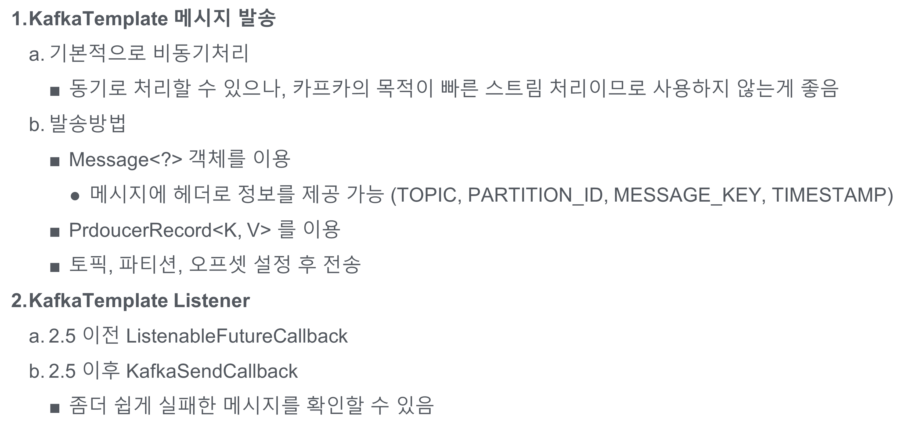

# clip3

kafka publish message

window 에서 topic 삭제 문제 해결에 도움 받음.

근데 rmr은 deprecated
The command 'rmr' has been deprecated. Please use 'deleteall' instead.

http://ngmsoftware.com/bbs/board.php?bo_table=study&wr_id=674&sfl=mb_id%2C1&stx=admin&sst=wr_nogood&sod=desc&sop=and&page=22